# 3D Artist Portfolio

Projeto Front-end conceitual desenvolvido para simular o portfólio profissional de um **Character Artist / Designer 3D**, com foco na apresentação de personagens, projetos e processos criativos para jogos e experiências digitais.

A proposta do projeto foi construir uma experiência visual imersiva e moderna, inspirada em portfólios de artistas digitais e no universo de **Character Design e Game Art**.

O projeto foi desenvolvido utilizando **React, TypeScript, Vite e CSS**.

---

## 🌐 Demo

rester-fullstack.github.io/voidframe-3d-portfolio/

> O link da demonstração será disponibilizado após a publicação do projeto.

---

## 🖼️ Prévia

Abaixo estão algumas das principais telas desenvolvidas para o projeto.

### Home

Apresentação principal do portfólio, destacando a identidade visual e os personagens.

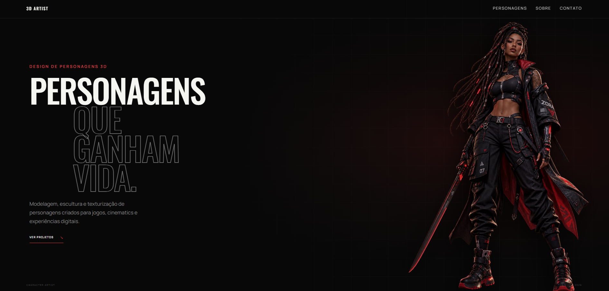
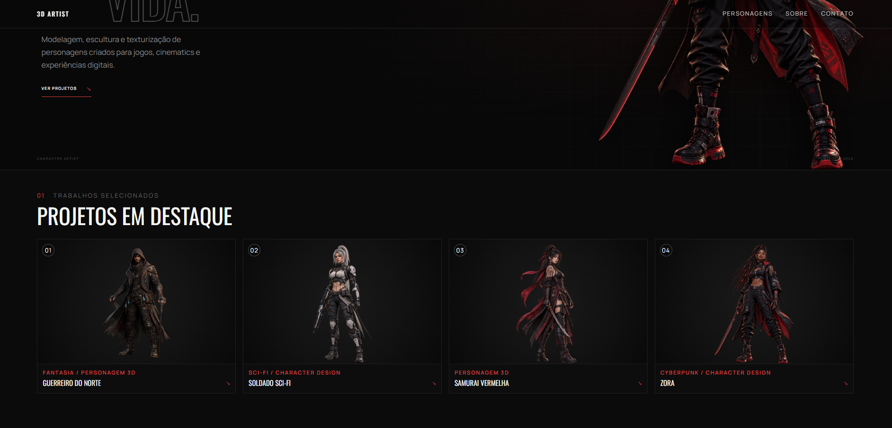

---

### Personagens

Galeria com os personagens utilizados na demonstração da aplicação.

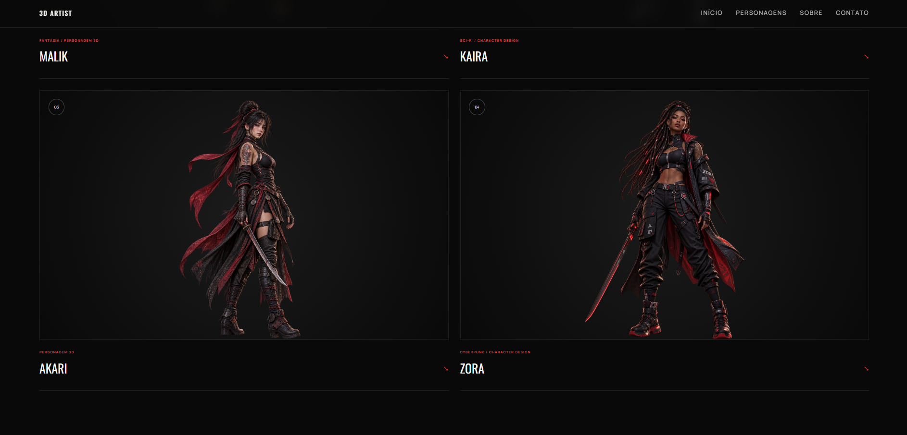
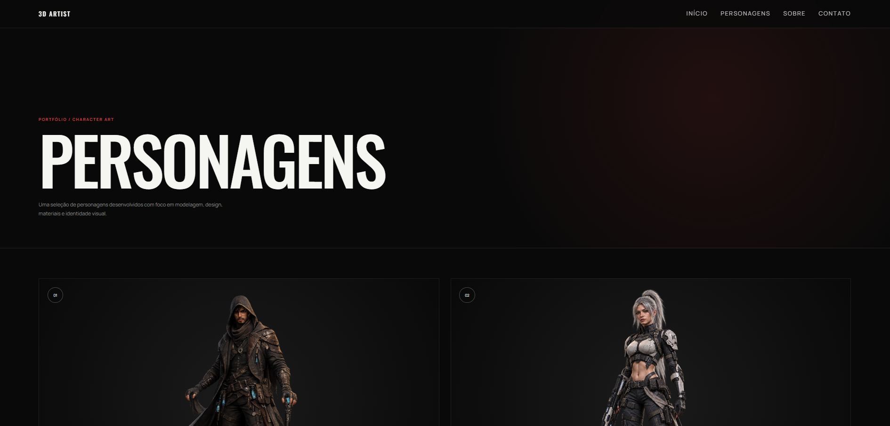

---

### Detalhes do personagem

Página individual destinada à apresentação das informações e características de cada personagem.

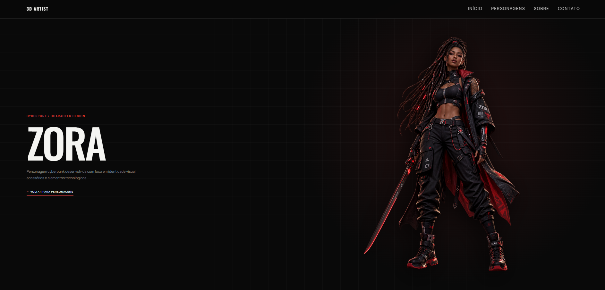
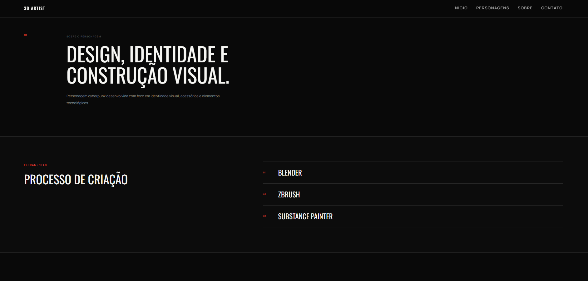


---

### Processo de desenvolvimento — Zora

A personagem Zora foi utilizada como case demonstrativo para apresentar visualmente as etapas de escultura, modelagem e texturização.

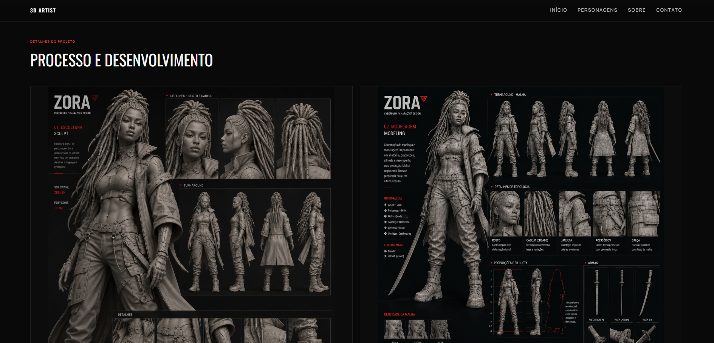
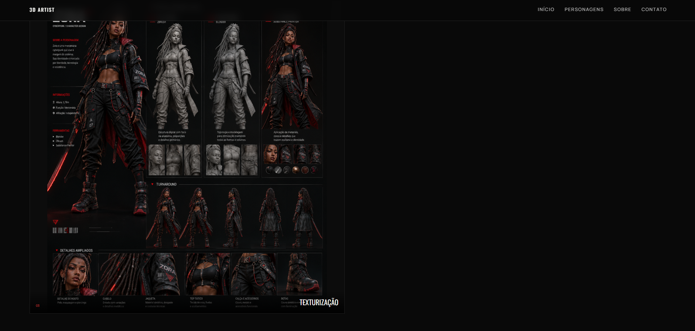

---

### Sobre

Página conceitual criada para demonstrar como seria a apresentação profissional de um Character Artist / Designer 3D.

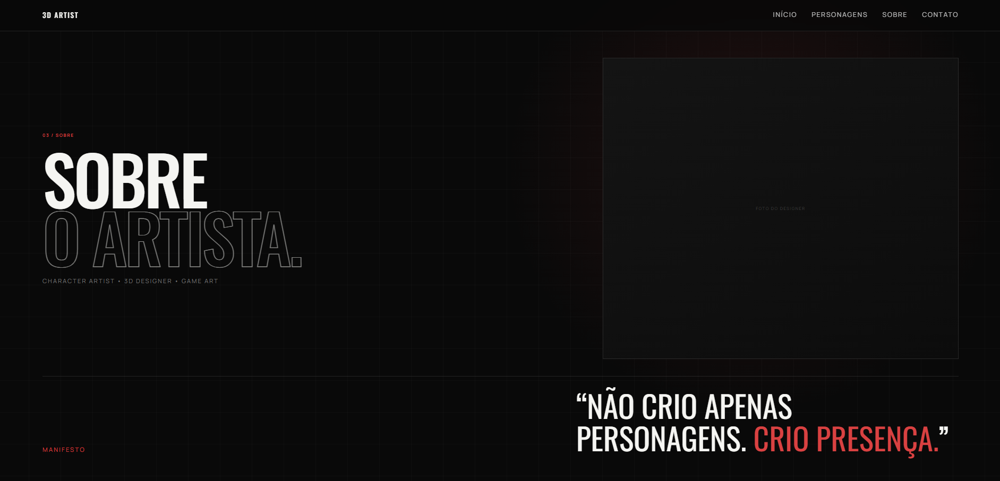
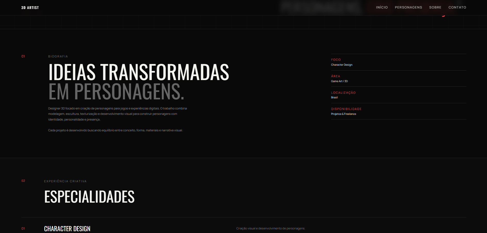
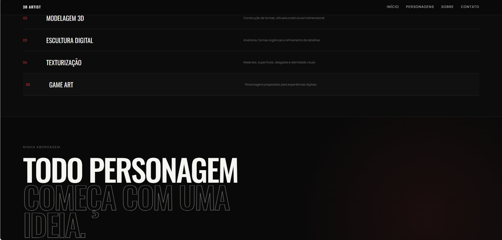
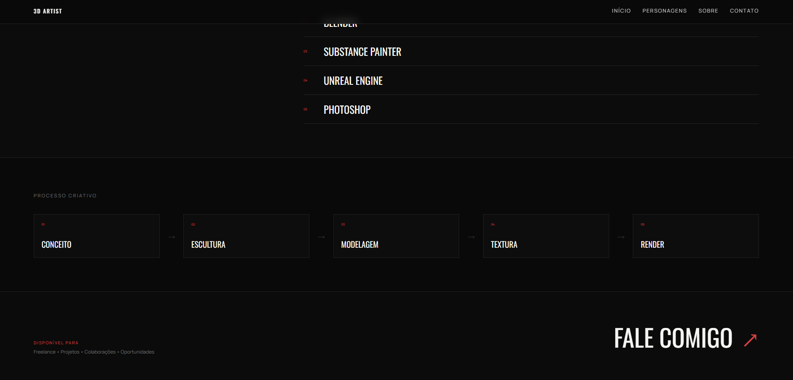

---

### Contato

Interface destinada à apresentação dos canais de contato e formulário.

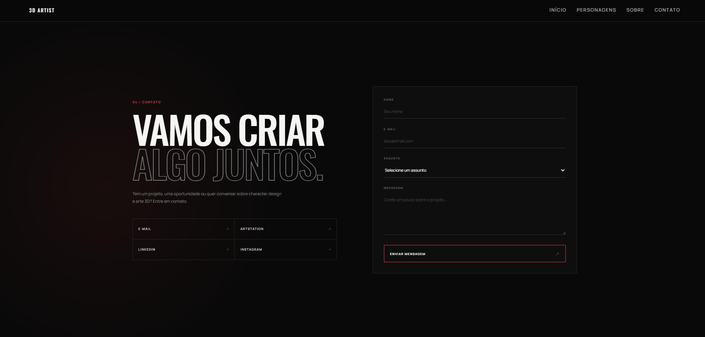

---

## ⚠️ Sobre o conteúdo demonstrativo

Este projeto é uma **demonstração conceitual de interface e desenvolvimento Front-end**, criada exclusivamente para fins de estudo e portfólio.

### Todas as informações apresentadas no site são fictícias e utilizadas apenas para fins visuais e demonstrativos.

Isso inclui:

- nomes dos personagens;
- descrições dos personagens;
- biografia do artista;
- informações profissionais;
- especialidades;
- ferramentas;
- informações de contato;
- dados dos projetos;
- textos relacionados ao processo criativo;
- etapas de escultura;
- etapas de modelagem;
- etapas de texturização;
- demais informações utilizadas para preencher a interface.

Essas informações **não representam uma pessoa, cliente, empresa ou projeto profissional real**.

As informações relacionadas a **Escultura, Modelagem e Texturização** fazem parte da apresentação conceitual da interface e não devem ser interpretadas como documentação de um processo profissional real de produção 3D.

Os personagens, imagens e materiais visuais presentes na aplicação são utilizados como conteúdo demonstrativo para apresentar o funcionamento e o design da experiência web.

### O foco deste repositório é o desenvolvimento da aplicação.

---

# ✦ Sobre o projeto

O objetivo foi desenvolver uma aplicação que representasse como poderia ser o portfólio digital de um profissional especializado em:

- Character Design;
- Character Art;
- Modelagem 3D;
- Game Art;
- Escultura Digital;
- Texturização.

Em vez de utilizar uma estrutura tradicional de portfólio, a aplicação aposta em uma apresentação mais visual e editorial.

A interface utiliza personagens como elemento principal da composição e combina grandes títulos, imagens, grids, espaços negativos e pequenas informações técnicas.

---

# ✦ Direção visual

A identidade visual foi desenvolvida utilizando:

- fundo predominantemente escuro;
- detalhes em vermelho;
- iluminação sutil;
- gradientes;
- grid gráfico;
- tipografia de alto impacto;
- composições assimétricas;
- grandes áreas de respiro;
- linhas finas;
- elementos inspirados em interfaces de jogos;
- apresentação editorial dos projetos.

A intenção foi criar uma interface que transmitisse uma estética ligada ao universo de **Character Art, jogos e produção 3D**.

---

# ✦ Funcionalidades

A aplicação possui:

- Home com apresentação visual;
- navegação entre páginas;
- galeria de personagens;
- projetos em destaque;
- página dedicada aos personagens;
- página individual de personagem;
- rotas dinâmicas;
- informações detalhadas dos projetos;
- apresentação conceitual do processo de criação;
- seção de escultura;
- seção de modelagem;
- seção de texturização;
- visualizador de imagens;
- abertura das imagens em tela cheia;
- múltiplos níveis de zoom;
- movimentação da imagem ampliada utilizando o mouse;
- página Sobre;
- página de Contato;
- efeitos de hover;
- microinterações;
- layout responsivo.

---

# ✦ Personagens

A demonstração utiliza quatro personagens para compor a experiência visual do portfólio.

## Malik

Personagem utilizado para representar um projeto dentro da categoria de fantasia.

A apresentação explora uma estética voltada para Character Design e personagens de jogos.

---

## Kaira

Personagem utilizada para representar uma proposta visual de ficção científica.

Sua composição explora elementos tecnológicos e uma direção visual Sci-Fi.

---

## Akari

Personagem utilizada para representar uma direção artística inspirada em elementos orientais.

O projeto explora silhueta, vestuário e identidade visual.

---

## Zora

Zora funciona como o principal **case demonstrativo** da aplicação.

Além de aparecer como personagem de destaque na Home, possui uma página individual com uma apresentação conceitual do processo de desenvolvimento.

A página apresenta:

### 01 — Escultura

Demonstração visual de como uma etapa de escultura poderia ser apresentada dentro do portfólio.

### 02 — Modelagem

Demonstração visual da etapa de construção e apresentação do modelo 3D.

### 03 — Texturização

Apresentação visual de materiais, superfícies e detalhes da personagem.

> As etapas acima fazem parte da demonstração visual da aplicação e não representam necessariamente um processo real de produção do personagem.

---

# ✦ Visualizador de imagens

Um dos recursos desenvolvidos para a página individual do personagem é o visualizador de imagens.

Ao selecionar uma imagem do processo, ela pode ser aberta em destaque no centro da tela.

O usuário pode:

- abrir a imagem;
- visualizar em tela ampliada;
- aumentar o nível de zoom;
- utilizar diferentes níveis de aproximação;
- mover a imagem utilizando o mouse;
- observar pequenos detalhes;
- reduzir novamente o zoom;
- fechar o visualizador.

Essa funcionalidade foi desenvolvida pensando principalmente na apresentação de imagens detalhadas de projetos criativos.

---

# ✦ Página Sobre

A página **Sobre** foi desenvolvida com uma composição editorial voltada à apresentação de um profissional da área criativa.

A página possui áreas destinadas a:

- apresentação;
- biografia;
- especialidades;
- abordagem criativa;
- ferramentas;
- workflow;
- processo de desenvolvimento;
- disponibilidade profissional.

> Os dados exibidos nessa página são fictícios e utilizados somente para demonstrar o design da interface.

---

# ✦ Página de Contato

A aplicação também possui uma página dedicada ao contato.

A interface contém campos para:

- nome;
- e-mail;
- assunto;
- mensagem.

Também existe espaço para apresentação de canais externos, como redes profissionais e portfólios.

> As informações apresentadas na página são demonstrativas.

Caso o formulário ainda não esteja conectado a um serviço de envio, ele deve ser considerado apenas parte da demonstração visual da aplicação.

---

# ✦ Tecnologias

## Front-end

- React
- TypeScript
- Vite
- React Router

## Estilização

- CSS3
- CSS Grid
- Flexbox
- Media Queries
- Responsive Design
- Transições CSS
- Animações CSS

## Ferramentas de desenvolvimento

- Git
- GitHub
- npm

---

# ✦ Estrutura do projeto

Uma representação simplificada da organização da aplicação:

```text
src/
│
├── data/
│   └── characters.ts
│
├── pages/
│   ├── Home.tsx
│   ├── Characters.tsx
│   ├── CharacterDetails.tsx
│   ├── About.tsx
│   └── Contact.tsx
│
├── App.tsx
├── App.css
├── index.css
└── main.tsx

public/
│
└── characters/
    ├── malik.png
    ├── kaira.png
    ├── akari.png
    │
    └── zora/
        ├── zora-hero.png
        ├── zora-sculpt.png
        ├── zora-modeling.png
        └── zora-texturing.png
```

A estrutura pode sofrer alterações conforme novas funcionalidades sejam adicionadas ao projeto.

---

# ✦ Rotas

A navegação da aplicação é realizada utilizando **React Router**.

Estrutura principal:

```text
/                     Home

/characters           Personagens

/characters/:slug     Detalhes do personagem

/about                Sobre

/contact              Contato
```

A utilização de uma rota dinâmica permite reutilizar a estrutura da página de detalhes para diferentes personagens.

---

# ✦ Responsividade

A aplicação foi desenvolvida considerando diferentes tamanhos de tela.

Foram utilizados breakpoints para adaptar:

- navegação;
- tipografia;
- espaçamentos;
- imagens;
- grid de personagens;
- página de detalhes;
- página Sobre;
- página de Contato;
- visualizador de imagens.

O objetivo é manter a identidade visual e a usabilidade da aplicação em diferentes dispositivos.

---

# ✦ Como executar o projeto

## 1. Clone o repositório

```bash
git clone URL-DO-REPOSITORIO
```

## 2. Entre na pasta

```bash
cd NOME-DO-PROJETO
```

## 3. Instale as dependências

```bash
npm install
```

## 4. Execute o projeto

```bash
npm run dev
```

O Vite exibirá no terminal o endereço local da aplicação.

Normalmente:

```text
http://localhost:5173
```

---

# ✦ Build

Para gerar a versão de produção:

```bash
npm run build
```

Os arquivos serão gerados dentro da pasta:

```text
dist/
```

Para visualizar o build localmente:

```bash
npm run preview
```

---

# ✦ Deploy

O projeto pode ser publicado utilizando **GitHub Pages**.

Após a configuração do deploy, o endereço público poderá ser adicionado na seção **Demo** deste README.

Exemplo:

```text
https://usuario.github.io/nome-do-repositorio/
```

---

# ✦ Objetivo técnico

Este projeto foi desenvolvido para demonstrar habilidades relacionadas à construção de aplicações Front-end e experiências digitais.

Durante o desenvolvimento foram trabalhados conceitos como:

- React;
- TypeScript;
- componentes;
- organização de páginas;
- gerenciamento de dados;
- rotas;
- rotas dinâmicas;
- CSS;
- CSS Grid;
- Flexbox;
- responsividade;
- hierarquia visual;
- UI Design;
- UX;
- interações;
- visualização de imagens;
- zoom;
- manipulação de eventos do mouse;
- estruturação de portfólios digitais.

Além da implementação técnica, o projeto explora a construção de uma identidade visual direcionada a um segmento específico.

---

# ✦ Conteúdo fictício e finalidade

Para evitar qualquer interpretação incorreta:

> **Todo o conteúdo utilizado para representar o Character Artist dentro da aplicação é demonstrativo.**

Nomes, descrições, biografias, especialidades, ferramentas, contatos, processos, projetos e demais informações exibidas no site não devem ser considerados informações profissionais reais.

As etapas relacionadas à escultura, modelagem e texturização são utilizadas para demonstrar como um portfólio desse segmento poderia apresentar essas informações.

Da mesma forma, os personagens e materiais visuais servem como conteúdo para a composição da demonstração.

### O projeto apresentado neste repositório é a aplicação web.

O objetivo é demonstrar o desenvolvimento, a interface, as interações e a experiência de navegação.

---

# ✦ Status do projeto

### Concluído para demonstração.

O projeto pode continuar recebendo melhorias, como:

- novas animações;
- melhorias de acessibilidade;
- otimização de performance;
- novos personagens demonstrativos;
- melhorias para dispositivos móveis;
- integração real do formulário;
- novas interações;
- melhorias no visualizador de imagens.

---

# ✦ Autora

**Ester da Costa Batista**

Desenvolvedora de Software.

GitHub: **Rester-fullstack**

---

# ✦ Finalidade

Projeto desenvolvido para fins de:

- estudo;
- prática;
- demonstração técnica;
- composição de portfólio.

**As informações e conteúdos apresentados dentro da aplicação são utilizados para fins visuais e demonstrativos.**